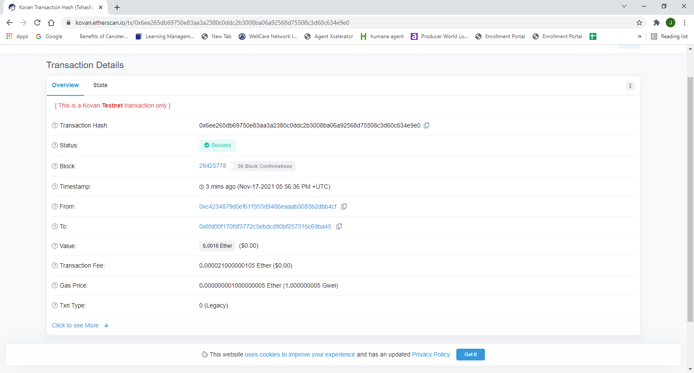

# fintech_finder
Fintech Finder is an application that its customers can use to find fintech professionals from among a list of candidates, hire them, and pay them using cryptocurrency.

## Requirements
This program uses:
    streamlit
    dotenv
    bip44
    web3
##Technologies

This project leverages python 3.7 with the following modules:

* [streamlit](https://streamlit.io) - For turning data scripts into shareable web apps.

* [dataclasses](https://docs.python.org/3/library/dataclasses.html) - Provides a decorator and functions for automatically adding generated special methods.

* [typing](https://docs.python.org/3/library/typing.html) - Provides runtime support for type hints.

* [os](https://docs.python.org/3/library/os.html) - Provides a portable way of using operating system dependent functionality.

* [requests](https://docs.python-requests.org/en/master/) - A HTTP library for Python.

* [dotenv](https://pypi.org/project/python-dotenv/) - For reading key-value pairs from a .env file and setting them as environment variables.

* [bip44](https://pypi.org/project/bip44/) - A Python implementation for deriving hierarchical deterministic wallets from a seed phrase based on the BIP-44 standard.

* [web3](https://web3py.readthedocs.io/en/stable/overview.html) - A Python library for connecting to and performing operations on Ethereum-based blockchains.

* [matplotlib](https://matplotlib.org/stable/users/index.html) - For embedding plots in the application.

## Running program
1. Clone repo from https://github.com/medina4595/fintech_finder
2. Install required libraries:
```shell
pip install -r requirements.txt
```
3. Have required keys in .env file
4. Run program by first being in the correct directory and then running:
```shell
streamlit run fintech_finder.py
```

## Screenshots





## Contributors

Jose Medina
